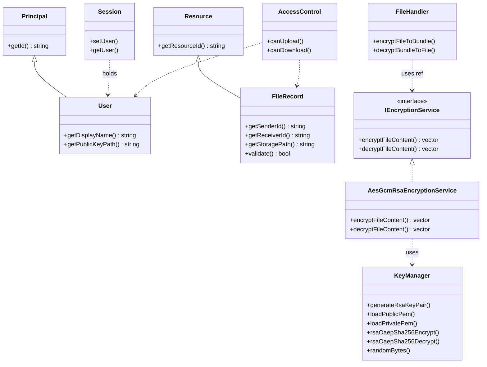
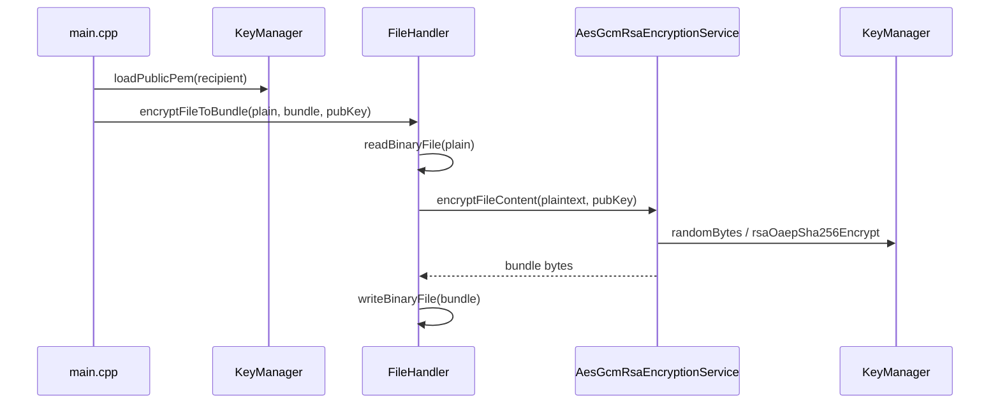
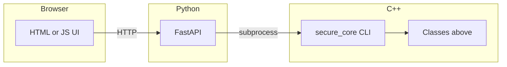

# How C++ Object-Oriented Programming Is Used in This Project

This document explains—in plain language—how classic **OOP ideas** show up in the **C++ core** (`cpp_core/`). The web server (Python) only *calls* the compiled program; the **design of the encryption logic** lives here in C++.

---

## 1. The four pillars (mapped to this codebase)

### Encapsulation — “Hide details, expose a clear interface”

- **`KeyManager`** hides OpenSSL calls (RSA key load, random bytes, encrypt/decrypt with OAEP). Other classes do not need to know *how* OpenSSL is invoked—only *what* to ask for (e.g. “wrap this AES key with this public key”).
- **`FileHandler`** hides reading/writing binary files and calls the encryption service to produce or consume a **bundle** file.

So: **data + behavior stay inside the class**, and the rest of the code talks through **methods**, not raw OpenSSL everywhere.

### Inheritance — “Is-a relationship, shared base”

- **`Principal`** is a base type for anything that has an identity (`id`).  
- **`User`** *is a* `Principal` and adds **display name** and **path to the public key file**.
- **`Resource`** is a base for anything stored as a resource with an id.  
- **`FileRecord`** *is a* `Resource` and adds **sender**, **receiver**, **storage path**, **original filename**.

This mirrors real-world wording: *a user is a kind of principal; a file record is a kind of resource*.

### Polymorphism — “Same operation, different implementation behind one interface”

- **`IEncryptionService`** is an **abstract interface** (pure virtual functions: encrypt/decrypt file content).
- **`AesGcmRsaEncryptionService`** **implements** that interface using **AES-256-GCM** and **RSA-OAEP** through `KeyManager`.

**`FileHandler`** holds a **reference** to `IEncryptionService`, not to the concrete class:

```text
FileHandler  →  uses  →  IEncryptionService  ←  implemented by  ←  AesGcmRsaEncryptionService
```

If you later added another implementation (e.g. for testing or another algorithm), you could swap it **without changing `FileHandler`’s public API**—that is polymorphism.

### Abstraction — “Work with simple ideas, not every low-level detail”

- The rest of the program thinks in terms of **encrypt file → bundle**, **decrypt bundle → file**, and **access rules**—not in terms of every OpenSSL `EVP_*` step.
- **`IEncryptionService`** is the main abstraction for “how file bytes are protected.”

---

## 2. Other important classes (short)

| Class | Role |
|--------|------|
| **`Session`** | Holds the **current `User`** (who is “logged in” in a CLI sense). |
| **`AccessControl`** | **Pure rules**: can this sender upload to this receiver? Can this user download this file? (Used in CLI `check-access`.) |
| **`CryptoException`** | One place for “crypto / IO failed” errors. |

---

## 3. UML — class diagram (core types)

Rough layout of **inheritance** and **dependencies** (not every method shown):



---

## 4. UML — sequence: encrypt a file (CLI `encrypt`)

Shows how objects **collaborate** for one operation:



---

## 5. UML — deployment view (who calls whom)

High-level picture including Python (not C++, but helps the viva):



---

## 6. One-sentence summary

**Encapsulation** in `KeyManager` / `FileHandler`, **inheritance** in `User` and `FileRecord`, **polymorphism** through `IEncryptionService` and `AesGcmRsaEncryptionService`, and **abstraction** so the CLI and future code can talk about “encrypt/decrypt” without scattering OpenSSL details everywhere.
